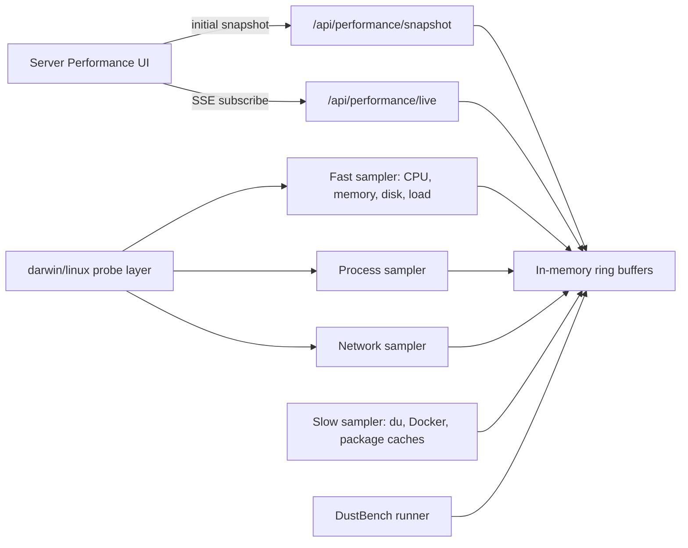

Status: drafted

# Plan 0033 — Realtime Cross-Platform Performance Analytics

## Context

Plan 0032 added the first Server Performance page, but it is not yet the
product Avery asked for.

Avery asked for:

- real-time Server Performance, not a page that waits and looks empty;
- DustPan that works on Linux and Mac;
- iStat-style stats, Little Snitch-style network visibility, and more;
- industry-grade analytics, charts, gadgets, bottleneck views, data views, and
  performance monitoring;
- a built-in GeekBench-style benchmark, but owned by DustPan and shaped for
  workstation/automation health instead of synthetic marketing scores.

The current failure proves the architecture needs to change:

- `ServerPerformancePanel` waits for one monolithic `/api/performance/status`
  fetch before it has any useful data.
- `get_performance_payload()` mixes fast metrics, slow `du`, network probes,
  service checks, process reads, and recommendations into one blocking request.
- Several probes are macOS-only (`vm_stat`, `sysctl`, `lsof` assumptions), so
  Linux support would degrade or show blanks.
- No rolling time-series exists yet, so the UI cannot show charts, spikes,
  bottlenecks, trends, or "what changed in the last 30 seconds."

## Approach

Build one shared **Realtime Performance Spine** and make the Server Performance
page subscribe to it.

The spine will sample cheap metrics frequently, expensive scans separately, and
publish small live events over SSE. The UI will render immediately with loading
states per gadget, then fill in each panel as its slice arrives.



Keep V1 local-first and read-mostly:

- no kernel extensions;
- no packet inspection;
- no silent network blocking;
- no arbitrary LAN scanning;
- no service kill/restart without approval gates.

## Tasks

1. **Split platform probes out of `web/server.py`.**
   - **Literal what-to-do**: Create `web/performance/` with `__init__.py`,
     `platform.py`, `sampler.py`, `network.py`, `processes.py`, `services.py`,
     `storage.py`, and `benchmark.py`.
   - **Files touched**: `web/server.py`, new `web/performance/*.py`.
   - **Dependencies**: none.
   - **Owner-agent**: backend/coder.

2. **Add Mac and Linux probe adapters.**
   - **Literal what-to-do**: In `web/performance/platform.py`, detect
     `platform.system()` and expose a common API:
     `disk()`, `load()`, `memory()`, `top_processes()`, `network_listeners()`,
     `network_connections()`, `service_health()`.
   - **Files touched**: `web/performance/platform.py`,
     `web/performance/network.py`, `web/performance/processes.py`.
   - **Dependencies**: task 1.
   - **Owner-agent**: backend/coder.
   - **Mac sources**: `shutil.disk_usage`, `os.getloadavg`, `vm_stat`,
     `sysctl`, `ps`, `lsof`.
   - **Linux sources**: `/proc/meminfo`, `/proc/loadavg`, `/proc/stat`,
     `/proc/net/tcp*`, `ps`, `ss` when available.

3. **Replace the monolithic endpoint with live and snapshot APIs.**
   - **Literal what-to-do**: Add:
     - `GET /api/performance/snapshot`
     - `GET /api/performance/live`
     - `GET /api/performance/benchmark`
     - `POST /api/performance/benchmark/run`
   - **Files touched**: `web/server.py`, `web/performance/sampler.py`,
     `web/performance/storage.py`, `web/performance/benchmark.py`.
   - **Dependencies**: tasks 1 and 2.
   - **Owner-agent**: backend/coder.

4. **Make the page render immediately.**
   - **Literal what-to-do**: Replace the single `api.performance()` wait in
     `apps/web/src/components/ServerPerformancePanel.tsx` with an initial
     snapshot fetch plus SSE subscription. Each gadget gets its own empty,
     loading, stale, and error state.
   - **Files touched**: `apps/web/src/components/ServerPerformancePanel.tsx`,
     `apps/web/src/lib/api.ts`, `apps/web/src/lib/types.ts`.
   - **Dependencies**: task 3.
   - **Owner-agent**: frontend/coder.

5. **Add chart and gadget components without a heavy chart dependency.**
   - **Literal what-to-do**: Create SVG-based components:
     `MetricSparkline`, `PressureGauge`, `ProcessLeaderboard`,
     `NetworkFlowTable`, `ServiceGrid`, `BottleneckRadar`, `BenchmarkCard`.
   - **Files touched**: new files under `apps/web/src/components/performance/`,
     `ServerPerformancePanel.tsx`.
   - **Dependencies**: task 4.
   - **Owner-agent**: frontend/coder.
   - **Reason**: keeps DustPan lightweight and DRY; one shared chart primitive
     powers CPU, memory, disk, network, process, and benchmark views.

6. **Add bottleneck analytics.**
   - **Literal what-to-do**: Add rule-based analysis that labels bottlenecks:
     disk pressure, memory pressure, CPU saturation, network chatter, Docker
     storage pressure, package-manager pressure, runaway process, service down,
     and benchmark regression.
   - **Files touched**: `web/performance/analytics.py`,
     `apps/web/src/components/performance/BottleneckRadar.tsx`.
   - **Dependencies**: tasks 1-5.
   - **Owner-agent**: backend/frontend pair.

7. **Build DustBench, DustPan's own benchmark suite.**
   - **Literal what-to-do**: Add a controlled, non-destructive benchmark runner
     that measures:
     - CPU burst score;
     - filesystem read/write scratch score in a temp directory;
     - JSON parse/serialize score;
     - subprocess spawn score;
     - local HTTP loopback score;
     - optional Docker responsiveness score if Docker is available.
   - **Files touched**: `web/performance/benchmark.py`,
     `apps/web/src/components/performance/BenchmarkCard.tsx`.
   - **Dependencies**: task 3.
   - **Owner-agent**: backend/coder.
   - **Safety**: benchmark writes only to a DustPan temp directory and deletes
     its own scratch files.

8. **Keep Cleaning separate but connected.**
   - **Literal what-to-do**: Server Performance recommendations should deep-link
     to existing Cleaning tabs (`emergency`, `docker`, `automation`) instead of
     duplicating cleanup buttons.
   - **Files touched**: `ServerPerformancePanel.tsx`, `DashboardContext.tsx`
     only if route/deep-link state needs a helper.
   - **Dependencies**: tasks 4-6.
   - **Owner-agent**: frontend/coder.

9. **Document the performance model.**
   - **Literal what-to-do**: Add docs explaining real-time sampling intervals,
     Linux/Mac support, benchmark meaning, and what DustPan deliberately does
     not do.
   - **Files touched**: `docs/server-performance.md`, `README.md` if a launch
     note is needed.
   - **Dependencies**: tasks 1-8.
   - **Owner-agent**: docs/copy-editor.

## Critical files

- `plans/0033-realtime-cross-platform-performance-analytics.md`
- `plans/README.md`
- `web/server.py`
- `web/performance/__init__.py`
- `web/performance/platform.py`
- `web/performance/sampler.py`
- `web/performance/storage.py`
- `web/performance/network.py`
- `web/performance/processes.py`
- `web/performance/services.py`
- `web/performance/analytics.py`
- `web/performance/benchmark.py`
- `apps/web/src/components/ServerPerformancePanel.tsx`
- `apps/web/src/components/performance/MetricSparkline.tsx`
- `apps/web/src/components/performance/PressureGauge.tsx`
- `apps/web/src/components/performance/ProcessLeaderboard.tsx`
- `apps/web/src/components/performance/NetworkFlowTable.tsx`
- `apps/web/src/components/performance/ServiceGrid.tsx`
- `apps/web/src/components/performance/BottleneckRadar.tsx`
- `apps/web/src/components/performance/BenchmarkCard.tsx`
- `apps/web/src/lib/api.ts`
- `apps/web/src/lib/types.ts`
- `docs/server-performance.md`

## Verification

Run:

```bash
cd /Users/nivram/Developer/dustpan && python3 -m py_compile web/server.py web/performance/*.py web/cleaners.py
```

Expected output: no Python syntax errors.

Run:

```bash
cd /Users/nivram/Developer/dustpan && make check
```

Expected output: AppleScript, CLI references, Python imports, and AppleScript
library checks pass.

Run:

```bash
cd /Users/nivram/Developer/dustpan && pnpm --dir apps/web exec tsc --noEmit --pretty false
```

Expected output: no TypeScript errors.

Run:

```bash
cd /Users/nivram/Developer/dustpan && pnpm --dir apps/web exec vite build
```

Expected output: Vite build completes.

Run:

```bash
cd /Users/nivram/Developer/dustpan && python3 - <<'PY'
import sys, time
sys.path.insert(0, "web")
from performance.sampler import get_snapshot
snap = get_snapshot()
print(bool(snap.get("system")))
print(bool(snap.get("series")))
PY
```

Expected output:

```text
True
True
```

Manual smoke:

```bash
cd /Users/nivram/Developer/dustpan && make ui-local
```

Expected:

- Server Performance page renders immediately.
- CPU, memory, disk, process, network, service, and bottleneck gadgets update
  live without refreshing the page.
- Slow scan cards show their own loading state instead of blocking the page.
- Benchmark card can run DustBench and report a score/history.
- Cleaning remains a separate page/category flow.

Linux smoke, from a Linux checkout:

```bash
cd dustpan && python3 -m py_compile web/server.py web/performance/*.py web/cleaners.py
```

Expected: Linux adapters import without macOS command assumptions.

## Out of scope

- Deep packet inspection.
- Kernel extensions, packet filters, or silent firewall blocking.
- A full Little Snitch replacement.
- Real GeekBench compatibility or score claims.
- Remote arbitrary LAN scanning.
- Service kill/restart controls before a separate approval-gated controls plan.
- Adding Postgres, Docker, or heavyweight chart dependencies for this feature.
